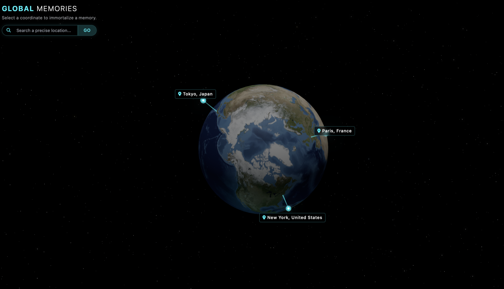
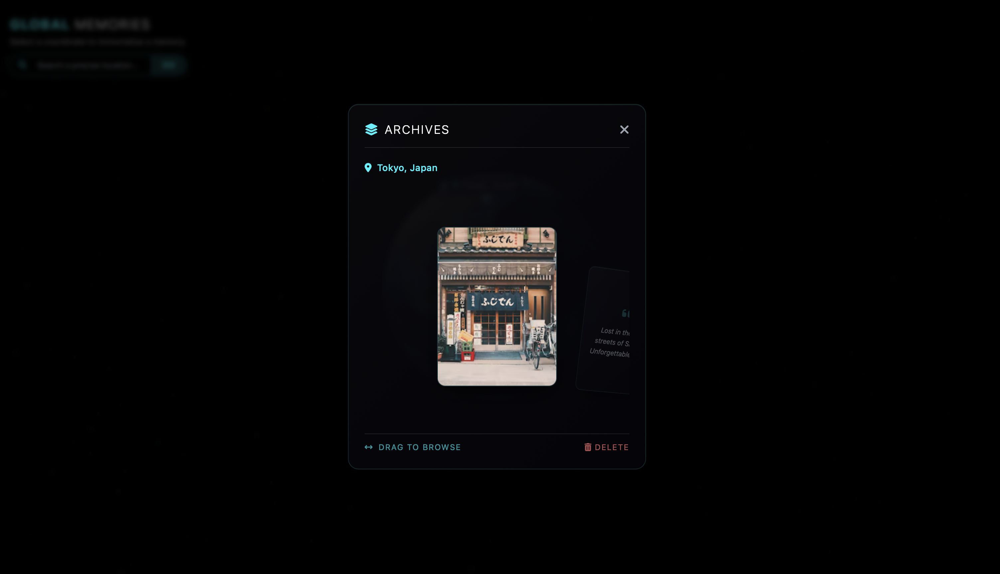
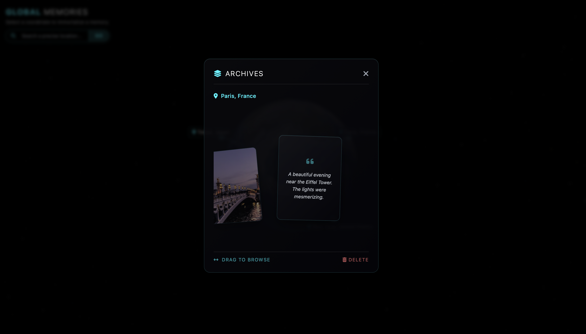
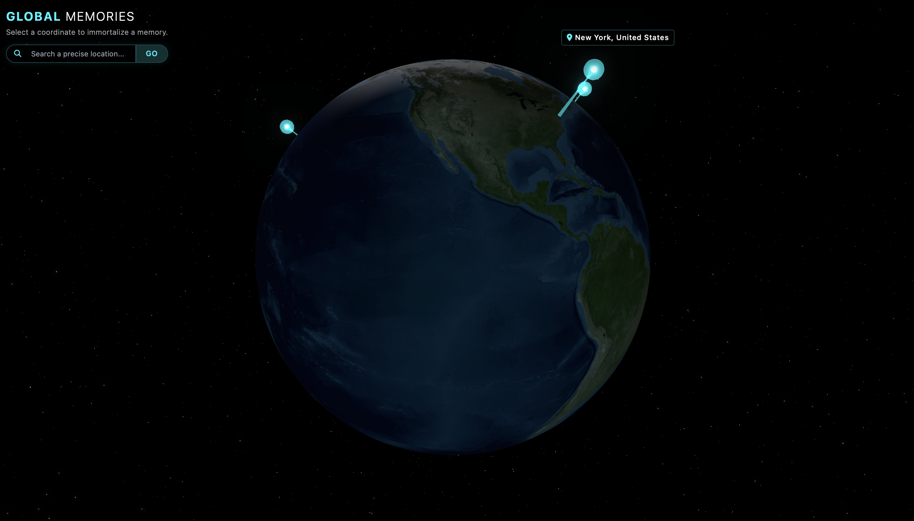

# Global Memories

An interactive 3D memory globe that allows user to drop photos and notes onto coordinates on a
rotating Earth and revisit them in a circular gallery. Packaged as a cross-platform
desktop app with [Electron](https://www.electronjs.org/).


## Features

- Photorealistic, rotating 3D Earth (Three.js + bloom post-processing)
- Click any coordinate to deposit a memory (photo + note)
- Search any place by name and fly the camera to it
- Circular, draggable gallery to browse memories at a location
- Persistent storage via IndexedDB
- Delete memories you no longer want

## Showcase

| | |
|:---:|:---:|
|  |  |
| **The globe.** Pinned memories float above their coordinates | **Archives.** Flip through the photos and notes at a location |
|  |  |
| **A single memory.** Its photo and the note beside it | **Fly to any place.** Search a location and the camera travels there |

## How it works

1. **Drop a memory.** Click anywhere on the globe. A ray is cast onto the Earth
   mesh to get the exact latitude/longitude, which is reverse-geocoded into a
   place name (via the BigDataCloud API). Add a photo and a note, and a glowing
   marker is pinned at that coordinate.
2. **Revisit.** Click a marker to open its archive, a circular, draggable
   gallery of every memory saved at that spot, each showing the photo and note.
3. **Fly there.** Type a place into the search bar and the camera animates
   across the globe to that location.
4. **Curate.** Delete any memory you no longer want to keep.

Everything you save persists locally in **IndexedDB** (used instead of
localStorage so large photos don't hit the storage quota), scoped to this app, and
nothing is uploaded to a server.

The globe itself is a Three.js scene with a day/night Earth, a cloud layer, an
atmospheric glow, and `UnrealBloomPass` post-processing for the neon marker glow.

## Getting started

```bash
npm install     # install dependencies
npm start       # launch the app
```

## Building a distributable

```bash
npm run dist    # build a .dmg (macOS) / installer (Windows)
npm run pack    # build an unpacked app directory (faster, for testing)
```

## Project Structure

```
.
├── main.js              # Electron main process (creates the window)
├── preload.js           # contextIsolation preload bridge
├── package.json         # scripts + electron-builder config
├── renderer/
│   └── index.html       # the app (Three.js globe + UI + persistence)
└── build/               # icon sources + generate_icon.py (app icon assets)
```

## Notes

- Three.js, Tailwind, Font Awesome, and the Earth textures load from CDNs, so an
  internet connection is required at runtime.
- Memories (including uploaded photos) are stored in the browser's IndexedDB,
  scoped to this app.

## License

MIT
